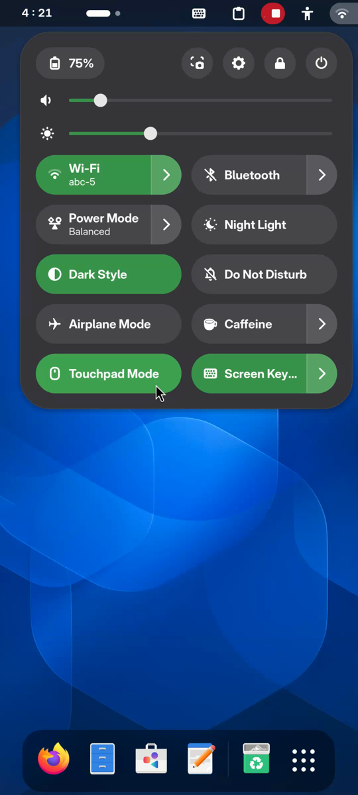

# GNOME Touchpad Emulator Toggle

A minimal GNOME Shell extension that adds a **Touchpad Mode** tile to the Quick Settings panel. One tap to start [TouchpadEmulator](https://gitlab.com/CalcProgrammer1/TouchpadEmulator), one tap to stop. Useful on Linux phones (postmarketOS, Mobian) where you want trackpad-style cursor input from a quick-settings toggle instead of hunting for the app icon.



## Why

TouchpadEmulator ships with a `.desktop` launcher, but on a phone it's faster to flip it from the same pulldown as Wi-Fi and brightness. Tapping the tile spawns the binary directly and tracks its lifecycle — no polling, no `pkill` scanning, no shell launcher.

## Requirements

- GNOME Shell 45 – 50 (tested on 50.1).
- [`touchpad-emulator`](https://gitlab.com/CalcProgrammer1/TouchpadEmulator) installed and `/usr/bin/TouchpadEmulator` on `$PATH`.
- `/dev/uinput` and `/dev/input/event*` accessible to your user (the upstream `touchpad-emulator` package ships a udev rule for this).

On postmarketOS:

```sh
sudo apk add touchpad-emulator
```

## Install

```sh
git clone https://github.com/asidko/gnome-touchpad-emulator-toggle.git \
  ~/.local/share/gnome-shell/extensions/touchpad-emulator@local
```

Log out and log back in (Wayland — extensions can't be loaded into a running session), then enable:

```sh
gnome-extensions enable touchpad-emulator@local
```

The tile appears in Quick Settings as **Touchpad Mode**.

## How it works

- Spawns `/usr/bin/TouchpadEmulator` directly via `Gio.Subprocess`. `wait_async` on the child is the single source of truth for tile state — if the process exits for any reason, the tile auto-greys.
- Stop sends `SIGTERM` to the held subprocess handle, so there's no `pkill` scanning and no chance of killing the wrong process.
- A one-shot `pgrep` at startup adopts any TouchpadEmulator started outside the tile (e.g. autostart); for that case only, stop falls back to `pkill -f`.

## Notes for postmarketOS / Snapdragon devices

- TouchpadEmulator claims `iio-sensor-proxy` for its own screen-rotation feature. GNOME's auto-rotate quick-setting will disappear while the emulator is running and reappear on stop. This is expected — only one process can claim the accelerometer at a time.
- Alpine's `killall`/`pkill -x` silently fail to match process names longer than 15 characters (kernel `comm` truncation). The shipped `LaunchTouchpadEmulator.sh` hits this bug; this extension avoids it by spawning the binary directly and matching with `pkill -f`.

## Uninstall

```sh
gnome-extensions disable touchpad-emulator@local
rm -rf ~/.local/share/gnome-shell/extensions/touchpad-emulator@local
```

## License

MIT
